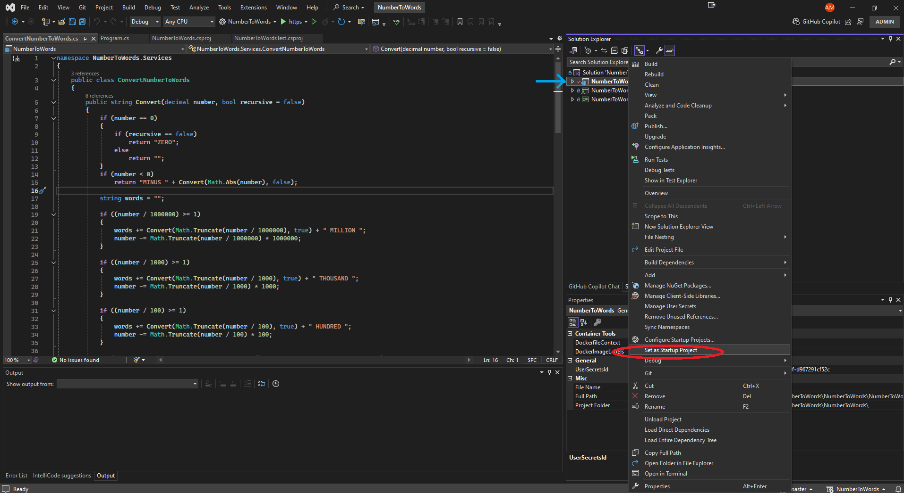
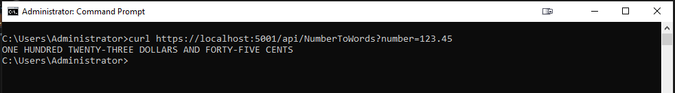

# NumberToWords

### Description

This project is a web API service that converts currency numbers to their corresponding strings.

### Programming Language

- C# (.NET Framework 4.7.2 or later)

### Dependencies

- Microsoft.AspNetCore.Mvc
- Microsoft.AspNetCore.Core

### API Endpoint

- `GET /api/NumberToWords?number={number}`: Convert a currency number to its corresponding string

### Usage

To use this project, run this project and simply send a request to the API endpoint with the currency number you want to convert, and the service will return the corresponding string.

#### Running by Visual Studio

1. Run this command in Command Prompt to clone the repository: `git clone https://github.com/SNARRANS/NumberToWords.git`
2. Open the solution in Visual Studio: `NumberToWords.sln`
3. Open the Solution Explorer by navigating to **\*View** > **Solution Explorer**.
4. click right button on NumberToWords project(the first project on picture) and select **Set as Startup Project**
   
5. Press hotkey to build and run the project: `Ctrl+Shift+B` and `F5`

#### Running by Command Prompt

1. Open Command Prompt
2. Run this command to clone the repository: `git clone https://github.com/SNARRANS/NumberToWords.git`
3. Redirect to NumberToWords project directory by this command: `cd NumberToWords\NumberToWords`
4. Build and run the project: `dotnet run`
   

#### Testing by cURL command

1. Open Command Prompt to use cURL to test.
2. Execute command to send a request to the API endpoint: `curl https://localhost:5001/api/NumberToWords?number=123.45`
   
