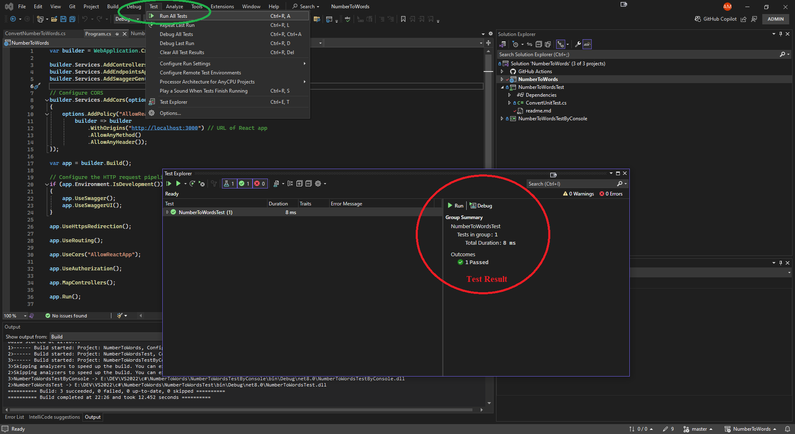
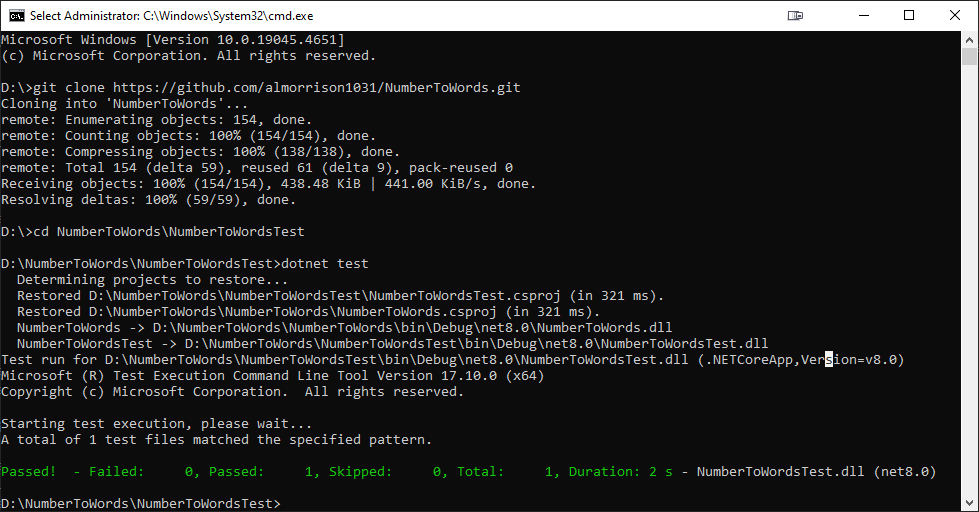

# NumberToWordsTest

### Description

This project is a testing framework for the NumberToWords web API using the `Microsoft.VisualStudio.TestTools.UnitTesting.Assert` library. The goal of this project is to ensure the correctness and reliability of the NumberToWords web API.

### Programming Language

- C# (.NET Framework 4.7.2 or later)

### Dependencies

- `Microsoft.VisualStudio.TestTools.UnitTesting.Assert` (version 15.9.0 or later)

### Usage

To use this project, follow these steps:

#### Prerequisites

- Visual Studio 2019 or later
- .NET Framework 4.7.2 or later

#### Running by Visual Studio

1. Run this command in Command Prompt to clone the repository: `git clone https://github.com/SNARRANS/Number-To-Words.git`
2. Open the solution in Visual Studio: `NumberToWords.sln`
3. Press hotkey to build the project: `Ctrl+Shift+B`
4. Run the unit tests by clicking the **Test** > **Run All Tests**.
   

#### Running by Command Prompt

1. Open Command Prompt
2. Run this command to clone the repository: `git clone https://github.com/SNARRANS/Number-To-Words.git`
3. Redirect to NumberToWordsTest project directory by this command: `cd NumberToWords\NumberToWordsTest`
4. Build and run the project: `dotnet test`
   
