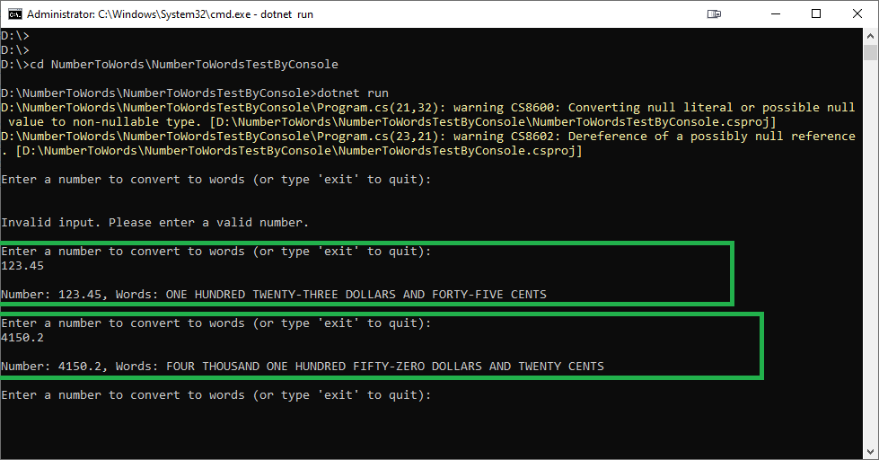

# NumberToWordsTestByConsole

### Description

This project, NumberToWordsTestByConsole, is a console-based application designed to test the NumberToWords web API service. The primary purpose of this project is to provide a simple and efficient way to test the functionality of the NumberToWords web API using a console interface.

### Programming Language

- C# (.NET Framework 4.7.2 or later)

### Usage

To use this project, follow these steps:

#### Running by Visual Studio

1. Run this command in Command Prompt to clone the repository: `git clone https://github.com/SNARRANS/Number-To-Words.git`
2. Open the solution in Visual Studio: `NumberToWords.sln`
3. Open the Solution Explorer by navigating to **View** > **Solution Explorer**.
4. click right button on NumberToWordsTestByConsole project(third project) and select **Set as Startup Project**
5. Press hotkey to build and run the project: `Ctrl+Shift+B` and `F5`
6. Input currency number and then will get output converted words.

#### Running by Command Prompt

1. Open Command Prompt
2. Run this command to clone the repository: `git clone https://github.com/SNARRANS/Number-To-Words.git`
3. Redirect to NumberToWords project directory by this command: `cd NumberToWords\NumberToWordsTestByConsole`
4. Build and run the project: `dotnet run`
5. Input currency number and then will get output converted words.
   

#### Example

Input: `1234.56`
Output: `ONE THOUSAND TWO HUNDRED THIRTY-FOUR DOLLARS AND FIFTY-SIX CENTS`
