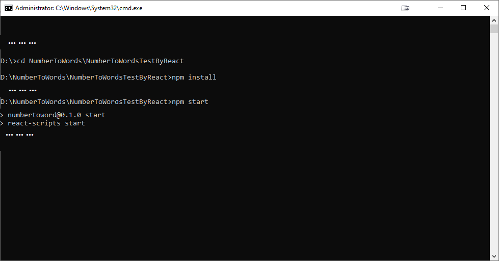
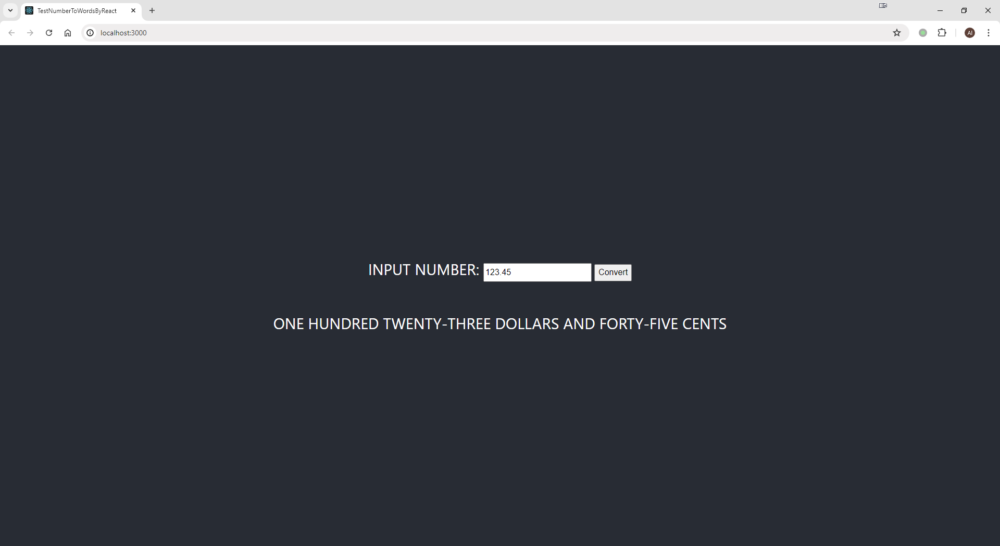

# NumberToWordsTestByReact

### Description

This project is a web interface to test the NumberToWords project web API. It provides a simple interface with a single input box and a convert button to test the API.

### Technology Stack

- Programming Language: TypeScript
- Framework: React

### Dependencies

This project depends on the following libraries:

- React

### Usage

#### Prerequisites

The NumberToWords web API service is running.

#### Running the Application

To run the application, follow these steps:

1. Open Command Prompt
2. Run this command to clone the repository: `git clone https://github.com/SNARRANS/NumberToWords.git`
3. Redirect to NumberToWords project directory(`NumberToWords\NumberToWordsTestByReact`) by this command: `cd NumberToWords\NumberToWordsTestByReact`
4. Install the dependencies using `npm install` or `yarn install`.
5. Start the application using `npm start` or `yarn start`.
   

#### Testing the API

1. Open the application in a web browser at `http://localhost:3000`.
2. Enter a currency number to convert in the input box.
3. Click the "Convert" button.
4. The equivalent word representation of the number will be displayed.
   
